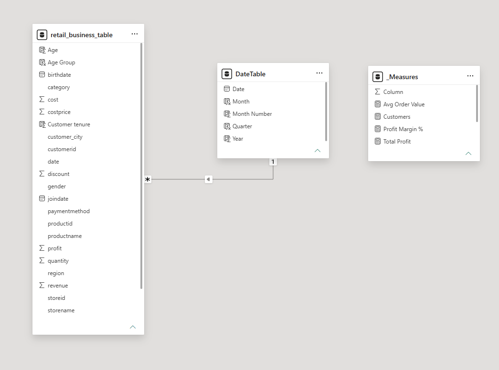
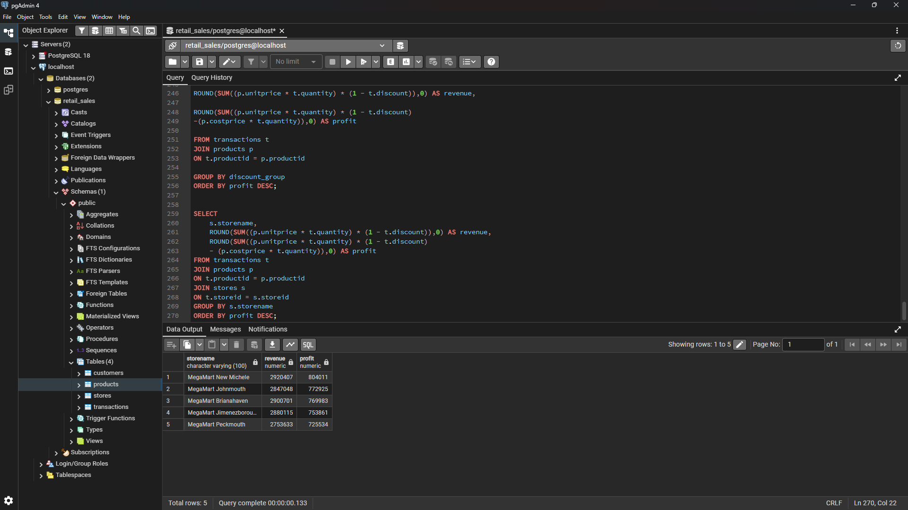
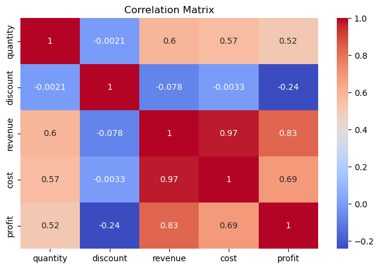
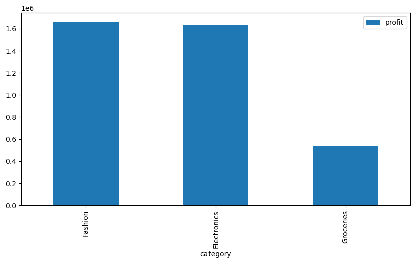
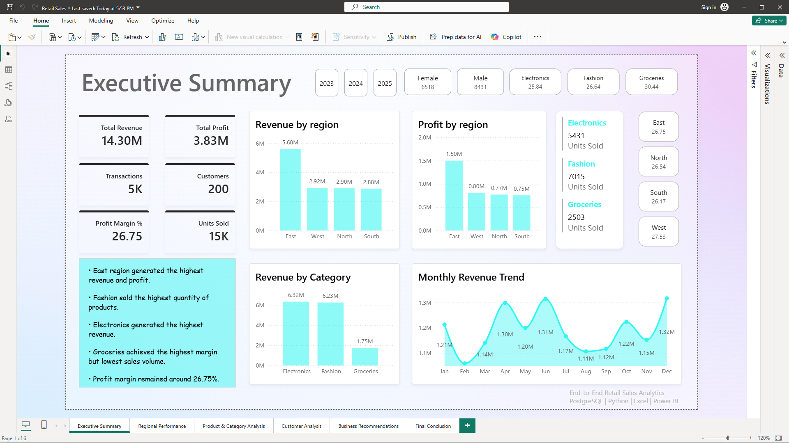
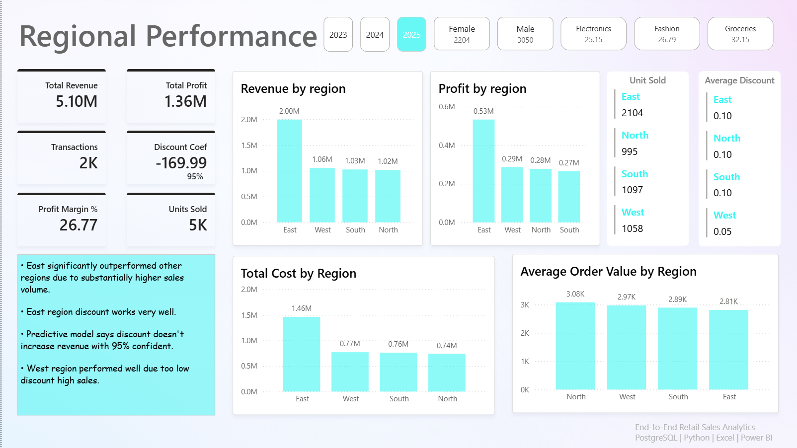
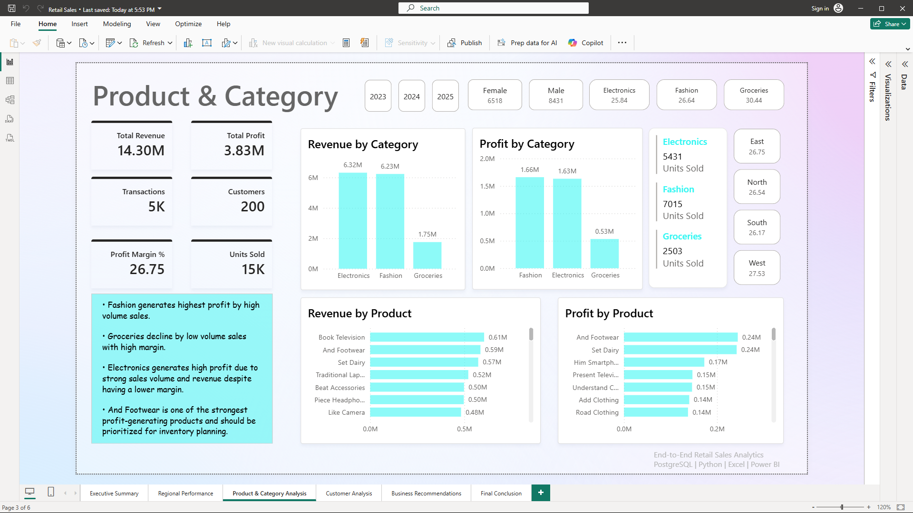

# Retail Sales Performance Analysis

## Project Overview

This project analyzes retail sales performance across products, stores, customers, and regions to identify revenue drivers, profitability trends, and business growth opportunities.

The analysis combines SQL, Python, Excel, and Power BI to transform raw transactional data into actionable business insights and executive-level dashboards.

---

## Business Objective

Retail businesses generate large volumes of transaction data every day, but raw data alone does not explain:

* Which regions drive the highest revenue?
* Which product categories generate the most profit?
* How discounts impact profitability?
* Which stores underperform despite strong sales?
* Where management should focus future growth efforts?

This project answers those business questions through an end-to-end analytics workflow.

---

## Dataset Overview

The dataset consists of multiple business entities:

| Table                 | Description                      |
| --------------------- | -------------------------------- |
| Customers             | Customer demographic information |
| Products              | Product details and categories   |
| Stores                | Store location information       |
| Transactions          | Sales transactions               |
| Retail Business Table | Consolidated business dataset    |

### Data Volume

* 200 Customers
* 50 Products
* 5 Stores
* 5,000 Transactions

---

# Predictive Analytics

## Revenue Prediction Model

Developed a Linear Regression model to identify key drivers of revenue and evaluate the impact of business variables.

### Features Used
- Cost
- Quantity
- Discount
- Product Category
- Region

### Model Performance
- R² Score: 0.956
- MAE: 331
- RMSE: 478

### Key Findings
- Cost and quantity positively impact revenue.
- Higher discounts negatively impact revenue.
- Electronics outperformed other product categories.
- Regional factors had lower predictive power compared to operational metrics.

### Statistical Validation
- Performed OLS Regression using Statsmodels.
- All major predictors achieved **P-value < 0.05**, indicating statistically significant relationships with revenue.

---

## Data Model

The data was structured into a relational model to enable accurate reporting and analysis across customers, products, stores, and transactions.

### Purpose

A proper data model improves:

* Query performance
* Relationship management
* Reporting accuracy
* Scalability for dashboard development

---

# Analytical Workflow

## 1. SQL Business Analysis

SQL was used to extract business-critical KPIs and answer key management questions.

### Key Business Questions

* Total Revenue Generated
* Total Profit Earned
* Top Revenue Generating Products
* Best Performing Regions
* Most Profitable Categories
* Revenue vs Profit by Store
* Impact of Discounts on Profitability

### Sample Business Analysis

### Business Insight

Store performance varies significantly when comparing revenue and profit.

High revenue does not always translate into high profitability, highlighting opportunities to optimize pricing strategies, product mix, and discount policies.

---

## 2. Python Exploratory Data Analysis

Python was used for statistical exploration and pattern discovery.

### Correlation Analysis

### Why This Analysis?

The correlation matrix identifies relationships between key business variables such as:

* Revenue
* Profit
* Discounts
* Product metrics

Understanding these relationships helps management identify factors influencing business performance.

### Category Profit Analysis

### Business Insight

Certain product categories contribute disproportionately to overall profitability, making them strong candidates for:

* Inventory expansion
* Marketing investment
* Strategic promotions

---

## 3. Executive Dashboard Development

Power BI dashboards were created to support decision-making at different organizational levels.

---

## Executive Summary Dashboard

### Purpose

Provides leadership with a high-level view of:

* Revenue
* Profit
* Customer activity
* Sales performance

### Business Value

Allows executives to quickly assess overall business health and monitor KPI performance.

---

## Regional Performance Dashboard

### Purpose

Evaluates performance across geographic regions.

### Key Insight

Regional analysis reveals sales concentration and identifies underperforming markets requiring strategic attention.

---

## Product Category Dashboard

### Purpose

Analyzes product category contribution to revenue and profit.

### Business Value

Supports:

* Product portfolio optimization
* Category investment decisions
* Inventory planning

---

# Key Findings

### Revenue Drivers

* A small group of products contributes a significant share of total revenue.
* Product mix plays a major role in overall business performance.

### Profitability Trends

* High sales volume does not always lead to high profit.
* Discount strategies require optimization to protect margins.

### Regional Opportunities

* Certain regions outperform others in both revenue and profitability.
* Underperforming regions represent growth opportunities.

### Category Performance

* Specific categories consistently generate stronger profit margins.
* Strategic focus on these categories can improve overall profitability.

---

# Business Recommendations

### Pricing Strategy

Review high-discount transactions and implement margin-protection policies.

### Product Optimization

Increase investment in high-margin product categories.

### Regional Expansion

Replicate successful regional strategies in lower-performing markets.

### Performance Monitoring

Track revenue and profit together rather than relying solely on sales volume.

---

# Tools Used

| Tool     | Purpose                                  |
| -------- | ---------------------------------------- |
| SQL      | Business Analysis                        |
| Python   | Exploratory Data Analysis                |
| Excel    | Data Preparation                         |
| Power BI | Dashboard Development                    |
| GitHub   | Version Control & Portfolio Presentation |

---

# Project Outcome

This project demonstrates the complete analytics lifecycle:

**Data Collection → Data Modeling → SQL Analysis → Python Exploration → Dashboard Development → Business Recommendations**

The final solution provides management with actionable insights for improving revenue growth, profitability, and operational performance.
