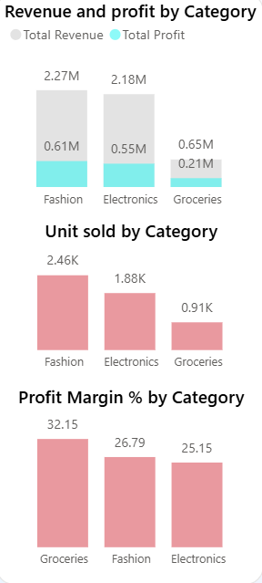
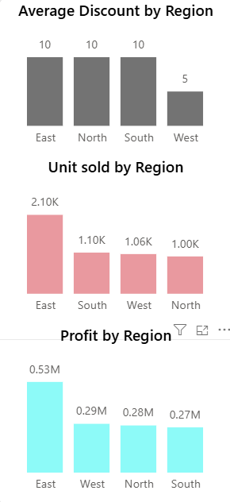
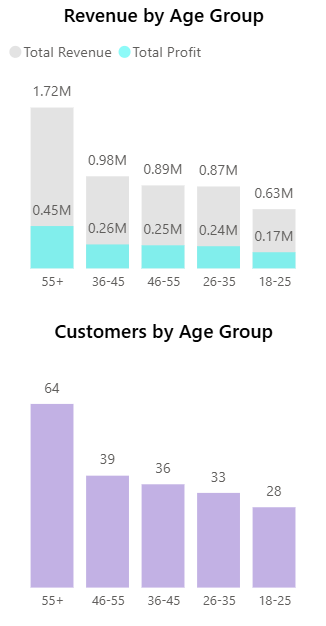
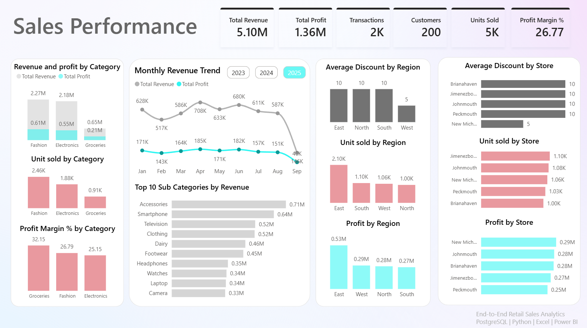
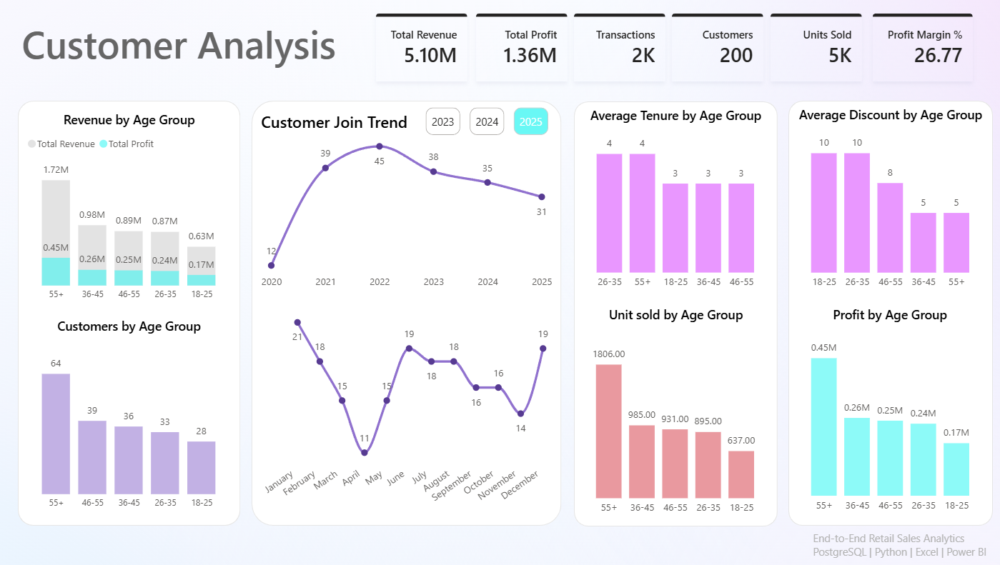
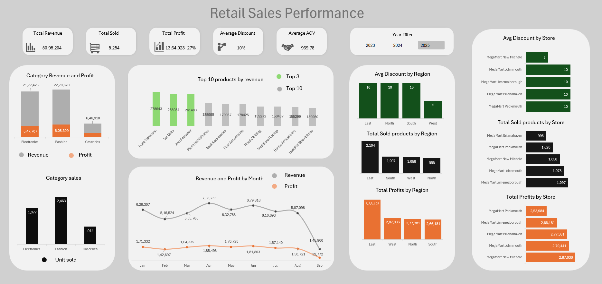

# Retail Performance & Profitability Analytics

A full-stack analytics project built on a simulated retail dataset — SQL for data modeling and extraction, Python for statistical analysis and forecasting, and Excel/Power BI for the reporting layer. The goal was to treat this like a real stakeholder request, not just an EDA notebook: define the business problem first, then build backward from it.

**Tools:** PostgreSQL · Python (Pandas, Scikit-learn, Statsmodels) · Excel · Power BI

---

## The Business Problem

MegaMart is a 5-store retail chain selling across three categories — Electronics, Fashion, and Groceries — through four regions. Leadership had transaction-level data sitting in a database but no consolidated view of where revenue and profit actually came from, whether their discounting was working, or which regions and stores needed attention.

Three questions drove the project:

1. Which categories and products are genuinely profitable, not just high-revenue?
2. Is the current discount strategy helping margin or quietly eating into it?
3. Where is performance uneven across regions and stores, and why?

## Who Would Use This

| Team | What they'd pull from it |
|---|---|
| Category / Merchandising | Which categories and SKUs to prioritize for inventory and shelf space |
| Pricing & Promotions | Whether discounts are actually converting into revenue, by category |
| Regional / Store Operations | Which regions and stores are underperforming and by how much |
| Finance / Leadership | Revenue, profit, and margin at a glance, filterable by year |
| Marketing / CRM | Which customer age segments are most valuable, for targeting |

---

## About the Dataset

Source: [Retail Sales Dataset on Kaggle](https://www.kaggle.com/datasets/buharishehu/retail-sales-dataset) — a simulated retail environment built around four related tables (customers, products, stores, transactions), intended for practicing data modeling and dashboarding rather than analyzing real sales history.

- **5,000 transactions**, 2023–2025
- **200 customers**, 50 products across 3 categories / 14 subcategories, 5 stores across 4 regions
- Revenue, cost, and profit aren't in the raw data — they're calculated fields I built from unit price, cost price, quantity, and discount

**What I'd flag before treating this as production-quality data:** product names and customer city names are auto-generated (e.g. "And Footwear," "Chair Laptop," "Port Jacob"), so they read as nonsense out of context — I kept them as-is rather than relabeling, since that would misrepresent the data. Discounts are capped at a narrow 0–15% band, there's no returns/refunds field, and there's no marketing spend or campaign field to tie promotions to outcomes. If I were scoping this as a real business dataset, I'd want realistic product naming, a wider discount range, and a promotions table to actually test what's driving the discount-revenue relationship rather than inferring it indirectly.

---

## Data Model

Star schema built in Power BI: the transaction fact table joined to a date dimension table (for year/month/quarter filtering) and a separate measures table holding the DAX calculations (Total Profit, Profit Margin %, Average Order Value, Customer count).

The SQL layer (`/SQL_Scripts`) mirrors this: `table_creation.sql` builds the four normalized tables, `table_retrive.sql` joins them into the flat table Python and Power BI both consume, and `business_queries.sql` / `data_analysis.sql` hold the aggregation queries used to sanity-check the Python and dashboard numbers against each other.

---

## Method

**SQL** — normalized schema, join logic, and the initial business queries (revenue/profit by category, region, store, product, and discount tier). This is the "what happened" layer.

**Python** (`retail_sales.ipynb`) — the "why" layer:
- Data quality checks (nulls, duplicates — none found on 5,000 rows)
- Distribution and correlation analysis across revenue, cost, profit, quantity, and discount
- A linear regression model predicting revenue from cost, quantity, and discount, validated with an OLS regression and a VIF check for multicollinearity

| Model | R² | RMSE | MAE |
|---|---|---|---|
| Linear Regression | 0.957 | 478.5 | 331.3 |
| OLS (statsmodels) | 0.956 | — | — |

VIF scores for all three features came in between 2.1 and 4.8 — well under the threshold where multicollinearity would be a concern, so the coefficients are trustworthy on their own.

**Excel & Power BI** — two dashboards (Sales Performance, Customer Analysis) built off the same underlying table, cross-checked against the SQL aggregates so the numbers agree everywhere.

---

## What the Data Shows

**Category profit doesn't track category revenue.** Electronics generates the most revenue (₹6.32M) but Fashion generates more profit (₹1.66M vs ₹1.63M) on less revenue, because it carries a better margin. Groceries brings in the least revenue by far but has the *highest* margin of the three (29.3% vs 26.7% for Electronics) — it's a small category punching above its weight, and a case for testing volume growth there rather than writing it off.



**East is carrying the business.** East generates roughly 39% of total revenue — nearly double any other single region — while West, North, and South are all within a tight band of each other. That's either a genuine regional strength worth studying and replicating, or a concentration risk if East softens.



**Discounting works in Electronics and doesn't in Groceries.** Electronics products hold revenue steady even at meaningful discount levels. Vegetables and packaged snacks, by contrast, get discounted at similar rates but don't convert that into revenue — the SQL discount-tier query and the Python correlation (discount vs. profit, r = -0.24) both point the same direction: discounting on low-consideration grocery items is currently a margin cost without a clear payoff.

**The 55+ segment is both the largest and the most valuable customer group** — 64 customers (the biggest age bracket) generating ₹1.72M, well ahead of every other segment. The 18–25 segment is the smallest and lowest-revenue. That's useful for deciding where a loyalty program pays off versus where the priority is acquisition.



---

## Recommendations

- **Pull back on Vegetables/Snacks discounting** — the data doesn't show it earning its cost. Redirect that promotional budget toward Electronics, where discounting demonstrably moves revenue.
- **Treat Groceries as a margin play, not a volume afterthought** — its 29.3% margin is the best of the three categories; worth testing whether modest inventory expansion pays off given how profitable each unit already is.
- **Investigate what East is doing differently** before assuming it's just a bigger market — if it's operational (staffing, store layout, local demand), it may be replicable in the other three regions.
- **Build retention efforts around the 55+ segment** and separately, a lighter-weight acquisition push for 18–25 — they're different problems and probably need different tactics.

---

## Dashboards

**Sales Performance** — category revenue/profit/margin, monthly trend, regional and store-level discount and profit breakdowns.



**Customer Analysis** — revenue and profit by age group, customer join trend by year, tenure and discount patterns by segment.



**Excel version** — the same KPIs rebuilt independently in Excel as a cross-check against the Power BI numbers, rather than just exporting one tool's output twice.



---

## Repository Structure

```
retail-sales-analysis/
├── Dataset/            raw CSVs (customers, products, stores, transactions) + combined table
├── SQL_Scripts/        table creation, data validation, and business query scripts
├── Python/             retail_sales.ipynb — EDA, correlation analysis, regression model
├── Excel Report/        Excel dashboard workbook
├── PowerBI/             Power BI dashboard file (.pbix)
├── Images/              dashboard exports and diagrams used in this README
└── README.md
```

---

## Author

**James**
SQL · Python · PostgreSQL · Power BI · Excel

GitHub: [Aloycious-James](https://github.com/Aloycious-James)
